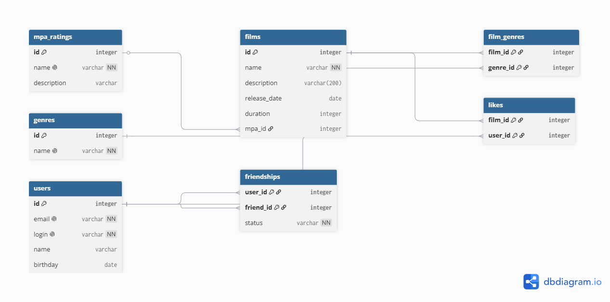

# java-filmorate
Template repository for filmorate project.

# Проект filmorate (Доработка модели данных)

## Схема базы данных (ER-диаграмма)



### Пояснение к схеме и примеры SQL-запросов

База данных спроектирована с учетом требований нормализации (1NF, 2NF, 3NF).

#### 1. Получение всех фильмов с их MPA-рейтингом
```sql
SELECT f.id, f.name, f.description, f.release_date, f.duration, m.name AS mpa_rating
FROM films AS f
LEFT JOIN mpa_ratings AS m ON f.mpa_id = m.id;
```

#### 2. Топ-10 наиболее популярных фильмов (по количеству лайков)
```sql
SELECT f.id, f.name, COUNT(l.user_id) AS likes_count
FROM films AS f
LEFT JOIN likes AS l ON f.id = l.film_id
GROUP BY f.id
ORDER BY likes_count DESC
LIMIT 10;
```

#### 3. Список общих друзей с другим пользователем

```sql
SELECT u.id, u.name, u.login
FROM users AS u
WHERE u.id IN (
    -- Друзья первого пользователя
    SELECT friend_id FROM friendships WHERE user_id = 1
) 
AND u.id IN (
    -- Друзья второго пользователя
    SELECT friend_id FROM friendships WHERE user_id = 2
);
```

